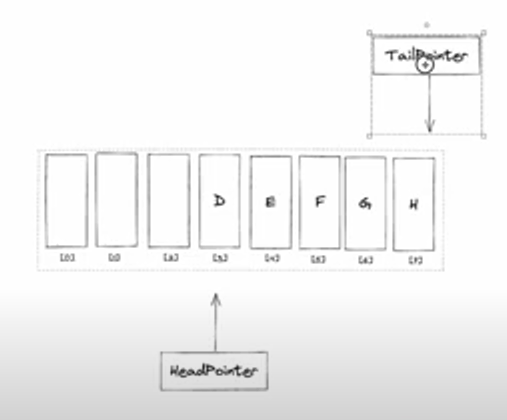

## Binary Search

```python
data: list[int] = []

def binarySearch(target):
    left = 0
    right = len(data) - 1

    while right >= left:
        mid = (right + left) // 2  # integer divion (DIV)

        if data[mid] > target:
            right = mid -1
        elif data[mid] < target:
            left = mid + 1
        else: # found
            return mid

    return -1 # if nout found
```

## Insertion Sort

```python
def insertion_sort(arr):
    for i in range(1, len(arr)):
        key = arr[i]
        j = i - 1
        while j >= 0 and arr[j] > key:
            arr[j + 1] = arr[j]
            j -= 1
        arr[j + 1] = key

# Example usage:
arr = [12, 11, 13, 5, 6]
insertion_sort(arr)
print("Sorted array is:", arr)
```

## Bubble Sort

```python
def bubble_sort(arr):
    n = len(arr)
    for i in range(n):
        for j in range(0, n-i-1): # subtract i to not check them again
            if arr[j] > arr[j+1]: # if large
                arr[j], arr[j+1] = arr[j+1], arr[j] # swap L with R

# Example usage:
arr = [64, 34, 25, 12, 22, 11, 90]
bubble_sort(arr)
print("Sorted array is:", arr)
```

## Stack

- need array/list, max size, top pointer
- **Push**: if not full, increment top pointer and store  (or do `arr.append(val)`)
- **Pop**: decrement top pointer, and optionally, reset the value to empty  (or do `arr.pop(<-1>)`)
- **Print**: print the list backwards, basically ( `print(arr[::-1])`-ish kinda thing )

```python
size = 8
topPointer = -1
stack = [ '' for i in range(size) ]

def push(newValue):
    global size, topPointer, stack
    if (topPointer+1) >= size:
        print("stack is full")
    else:
        topPointer += 1     # increment the pointer
        stack[topPointer] = newValue
        print("added to top of stack")

def pop():
    global size, topPointer, stack
    if topPointer < 0:
        print("no elements in stack")
    else:
        # dont actually delete the value, just decrement the pointer
        # stack[topPointer] = '' # unset value, then decrement
        topPointer -= 1 # decrement top pointer

def printStack():
    global size, topPointer, stack
    for i in range(size-1, -1, -1): #start: last, end: first (0), step: -1 
        if i == topPointer:
            print(f"{stack[i]}   <-- topPointer")
        else:
            print(f"{stack[i]}")
```

## Linear Queue

- one array/list for queue to store data
- head pointer (int)
- tail pointer (int)
- at empty queue, head-pointer = 0, tail-pointer = -1
- sometimes, tailP can change, adjust it accordingly in the first run

- **Enqueue**: 
    - check if full? if not,
    - increment tail pointer
    - store in new incremented tail pointer
    - increment number of elements

- **Dequeue**: 
    - optionally, remove current value at head-pointer (or replace)
    - increment head-pointer
    - decrement number of elements

```python
size = 8
num = 0 # basically for a len() like thing
headP = 0
tailP = -1
queue = ['' for _ in range(size)]

def enqueue(newData):
    global queue, num size, headP, tailP
    if num >= size:
        print("Queue is full")
    else:
        tailP += 1 # increment tailP
        queue[tailP] = newData # store in new tail index
        num += 1 # new element added, for len() like thing
        print("Added item to queue")

def dequeue():
    global queue, num size, headP, tailP
    if num <= 0:
        print("empty queue. no elements.")
    else:
        removed = queue[headP]
        headP += 1
        num -= 1
        print("removed element at fron of queue (element pointed by headP)")
        return removed
```


#### Linear Queues - Method 2

Use this incase if things go wrong. Using `collections` module (pre-installed)

```python
from collections import deque

data = deque()              # define
data.append("data")         # enqueue
removed = data.popleft()    # dequeue (remove index 0)
```

## Circular Queue

- no two methods, so remeber this.
- same stuff as linear queue, but wraps around.



- waste of memmory here. we can move the tail pointer to wrap around the empty spaces, not waste memmory. that is where the circular queues become handy. 
- note that when dequeuing, we should also to wrap around the head pointer

- **Enqueue:**
    - check if full? if not,
    - increment tail pointer
    - **if tailP > size-1: set tailP to 0**
    - store in new incremented tail pointer
    - increment number of elements

- **Dequeue**
    - optionally, remove current value at head-pointer (or replace)
    - increment head-pointer
    - decrement number of elements
    - **if headP > size-1: set headP to 0**


```python
size = 8
num = 0 # basically for a len() like thing
headP = 0
tailP = -1
queue = ['' for _ in range(size)]

def enqueue(newData):
    global queue, num size, headP, tailP
    if num >= size:
        print("Queue is full")
    else:
        tailP += 1 # increment tailP

        # adjust the queue to become circular
        # -----
        if tailP > size-1:
            tailP = 0
        # -----

        queue[tailP] = newData # store in new tail index
        num += 1 # new element added, for len() like thing
        print("Added item to queue")

def dequeue():
    global queue, num size, headP, tailP
    if num <= 0:
        print("empty queue. no elements.")
    else:
        removed = queue[headP]
        headP += 1
        num -= 1

        # adjust the queue to become circular
        # -----
        if headP > size-1:
            headP = 0
        # -----

        print("removed element at fron of queue (element pointed by headP)")
```


## Linked List

- Remember this

```python
# keep on going to next node, 
# until last node, 
# which points to None/-1
while cur.next != None: 
    cur = cur.next      # go to next note
    # do stuff here
    # ...
```

- Sample code:

```python
class Node:
    def __init__(self, data=None):
        self.data = data
        self.next = None

class LinkedList:
    def __init__(self):
        self.head = Node()
    
    def append(self, data):
        new_node = Node(data=data)
        cur = self.head # start from beginning

        while cur.next != None: # next element of current is not None
            # means, this is not the final node
            cur = cur.next # so, go to next node
        
        cur.next = new_node
    
    def length(self):
        cur = self.head
        total = 0
        while cur.next != None:
            total += 1
            cur = cur.next
        return total

    def display_linkedList(self):
        elems = []
        cur = self.head
        while cur.next != None:
            cur = cur.next
            elems.append(cur.data)
        print(elems)
    
    def get(self, index):
        # from 1, doesnt start from 0
        if index >= self.length():
            print("Index out of range!")
            return None
        
        cur_id = 0
        cur_node = self.head

        while True:
            cur_node = cur_node.next # go through every node
            if cur_id == index:
                return cur_node.data # break and return when index = cur_node idx
            cur_id += 1
    
    def erase(self, index):
        if index >= self.length():
            print("Index out of range!")
            return None
        
        cur_id = 0
        cur_node = self.head
        while True:
            last_node = cur_node
            cur_node = cur_node.next
            if cur_id == index: # when current node's index = given index
                last_node.next = cur_node.next
                return
            cur_id += 1


ll = LinkedList()
ll.display_linkedList() # []

ll.append(3)        
ll.append(5)        
ll.append(2)        
ll.append(9)        
        
ll.display_linkedList() # [3, 5, 2, 9]
```

## OOP

The `super()` function provides a way to call the methods of a parent class from within a child class.

```python
class Parent:
    def __init__(self, name):
        self.name = name
    
    def greet(self):
        print(f"Hello, my name is {self.name}")

class Child(Parent):
    def __init__(self, name, age):
        super().__init__(name)  # Call the parent class's __init__ method
        self.age = age
    
    def greet(self):
        super().greet()  # Call the parent class's greet method
        print(f"I am {self.age} years old")


child = Child("Alice", 12) # Instance of the Child class
child.greet()
# ---
# Hello, my name is Alice
# I am 12 years old

```

